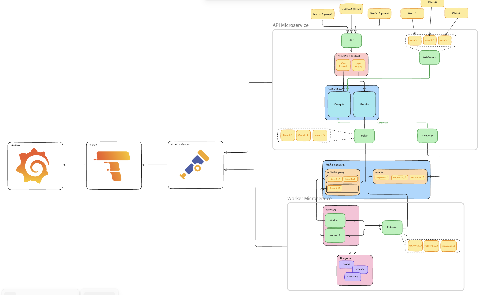

# AI-orchestration system

## The app

This app is a distributed AI orchestration system designed for asynchronous prompt processing, allowing users to run tasks or conduct long-term research. 
The system is designed to be highly available, fault-tolerant, and fast enough. 
For this purpose, the design consists of several microservices, which communicate via Redis Streams. 
This approach allows scaling application computing power horizontally, decreasing overall deployment cost. 
Also, the app is designed to be highly observable. 
There is already an integrated Grafana dashboard that shows not only tracing and performance metrics but also business metrics, such as *prompts/cost per user* and *AI model popularity across users*. 
The app is already set up for Gemini's free tier. Enabling it is described below.

## Architecture
Here is a visualization of the architectural design of the application:

> [!NOTE]
> You can see the full design [here](https://excalidraw.com/#json=DU78D5VdM8CY3sKzBp7Wg,hhjbzaImUoxO5ouQt_1bXA)

The idea might seem simple: Get the user prompt -> Send it to the AI model -> Return the result to the user.
But the underlying architecture is designed to be stable and to face business needs. First and foremost, using observability.
Here is a simple explanation of how it works under the hood:
1. The prompt is sent to the `POST /ask`
2. Prompt validated and processed. If there are validation issues, the client receives a **400** response status. Otherwise - **202 Accepted**.
3. An **Event** is generated and, within a single transaction, saved into PostgreSQL along with **Prompt**.
4. **Relay** background task, within the same microservice, reads from **outbox** table, and publishes the event into Redis Stream with ID "tasks".
5. Then, Redis automatically handles delivery via so-called "Consumer groups" to one out of 5-10 workers (this number is configured inside the Worker microservice).
6. The worker, from a Worker microservice, which is being run in a separate go-routine, reads the task delivered to him and starts processing.
7. The prompt is Unmarshalled and sent to Gemini (for now; later will be configurable).
8. The response is published back to another stream with ID "results".
9. The API microservice reads the result, updates the corresponding prompt inside the Postgres, and shares this entity using WebSocket.
10. The user is now able to read the AI answer using a WebSocket connection.


### A few considerations about integrating Redis Streams and Transactional Outbox:

Redis was chosen because it is fast and easily configurable. There is no need to overengineer an already complicated enough system.
The average task that may be processed via this service may take from 2 to 10-15 seconds to complete. So, competing with RabbitMQ
for an additional millisecond won't be a pragmatic decision. And since Redis already has such mechanisms as Pub/Sub and Streams, this is a nice opportunity to use them as a message broker.
Why Streams and not Pub/Sub? The answer is simple: Streams are persistent and reliable (acknowledgment mechanisms), while Pub/Sub stores data in memory
and follows the "fire and forget" principle.

Transactional Outbox was implemented to ensure data consistency. This is important that every request in a distributed system must be processed.
But if we fail to write to Postgres or publish to Redis, we must manually handle this message processing. Or the "dual-write" problem appeared,
when a user gets two different responses on a single prompt, even if the prompt was posted one time. This approach ensures prompts are saved to the DB and processed via Redis, so all our users will receive the results.

## Deployment

Docker deployment files are located in the [deployment/docker](deployment/docker) folder. 
To run the compose file, you are supposed to create `.api_env` and `.worker_env` files in the root directory of the project, with the
next variables:
**.api_env**
```dotenv
YAML_CFG_DIR=/app/config/app/api.yaml
POSTGRES_PASSWORD=your_secure_password
```
**.worker_env**
```dotenv
YAML_CFG_DIR=/app/config/app/api.yaml
GEMINI_API_KEY=your_api_key
```

> [!NOTE]
> To get an API key for using Gemini, go to "https://aistudio.google.com/". Click **View API keys**. 
> Copy the one you have enabled (by default, a free-tier API key is enabled). Paste into the .worker_env file.

All other configurations located in `config/app/.` so you can go here and check it out. There is located configurations for 
Redis streams, Postgres, Backoff, etc.

> [!NOTE]
> You might need to update you non-sensitive PostgreSQL credentials inside `config/app/api.yaml`

After this run: `docker compose -f deployment/docker/docker-compose.yml up --build -d`

To check whether everything is correct, check the logs of the container inside the Docker application.
The app should start with the appropriate message. 
Make a `GET` request via **Postman** or any other tool you like to the `http://localhost:8080/health` endpoint. 
If response **200**, everything is fine.

## Use

> For this section, I will use explanation on Postman example.

To test this all out, go to Postman and create a new tab with WebSocket connection. Enter the next url into the link blank:
`http://localhost:8080/ws?userID=2aa7637a-4ba0-44c8-adad-9957512ae6e0`. Then click **Connect**.

Then create a new tab with **POST** request. Then use the next values to fill the blanks:
```
Address: htt://localhost:8080/ask

BODY:
{
    "user_id" : "2aa7637a-4ba0-44c8-adad-9957512ae6e0",
    "model_id" : "gemini-3-flash-preview",
    "prompt": "Hello Gemini"
}
```

> [!IMPORTANT]
> Do not change the user_id provided in this request, since this is an ID you've connected to websocket with.

Click *Send* and switch to the WebSocket tab. After a certain amount of time (2-10 seconds) you will see the response.

## Observability & Distributed Tracing

The distributed tracing is implemented using OpenTelemetry and Grafana + Tempo.
To view the traces, you need to open `http://localhost:3000`, then in the login panel, enter the following credentials:
```
name: admin
password: secret
```
After this, select in the dashboard dropdown list **Connections**, go to **Data Sources**, 
search for **Tempo**, and on the opened page in the **Connection** field enter this address: `http://localhost:3100`.
That's it, now Grafana is ready to show you the traces. Go to **Explore**, in the **Query** tab, select **Search** one. 
Then go to Postman (or any tool you use to make requests) and do some. Return to Grafana and click **Run query**. 
Here it is: if you've done everything correctly, you should see some logs.

> [!NOTE]
> In case of any errors, you may check this link: [How to setup observability of Golang microservices using Jaeger, OTEL-collector, Tempo & Grafana](https://medium.com/@vahagn.mian/how-to-setup-observability-of-golang-microservices-using-jaeger-otel-collector-tempo-grafana-b502e72f2bf3)
