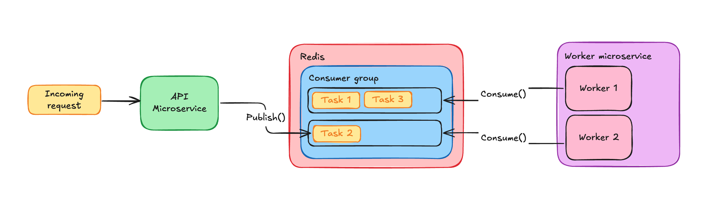

# AI-orchestration system

## Deployment

Docker deployment files located in [deployment/docker](deployment/docker) folder. 
To run the compose file you are supposed to create `.api_env` and `.worker_env` files in the root directory of the project, with the
next variables:
**.api_env**
```dotenv
PORT=8080
APP_ID=ai-orchestrator_api
REDIS_URI=redis:6379
JAEGER_URI=otel:6831
CACHE_TTL_MINUTES=5
REDIS_STREAM_ID=tasks
```
**.worker_env**
```dotenv
APP_ID=ai-orchestrator_worker
REDIS_URI=redis:6379
JAEGER_URI=otel:6831
REDIS_STREAM_ID=tasks
NUMBER_OF_WORKERS=5
```
After this run: `docker compose -f deployment/docker/docker-compose.yml up --build -d`

To check whether everything is correct, check the logs of the container inside docker application,
the app should start with the appropriate message. 
Make `GET` request via **Postman** or any other tool you like to the `http://localhost:8080/health` endpoint. 
If response **200** everything is fine.

## Redis integration
Redis used as a message broker between microservices. I have chose it, because of its easy integration to project, compared to RabbitMQ. Also it is already
used for caching, so there is no sense at this stage to integrate another complicated service. Moreover, Redis Streams, which were used in this implementation, 
gives you in this concrete case faster processing than basic RabbitMQ. So consider all these aspects, I decided to not overengineer my project and stand by Redis Stream.

Here is the underlying architecture of my approach:


## Distributed Tracing
The distributed tracing is implemented using Jaeger, OpenTelemetry and Grafana. Here is the workflow:

To view the traces, you need to open `http://localhost:3000', then in login panel enter next credentials:
```
name: admin
password: secret
```
After this, select in the dashboard dropdown list **Connections**, go to **Data Sources**, 
search for **Tempo** and on the opened page in the **Connection** field enter this address: `http://localhost:3100`.
That's it, now Grafana is ready to show you the traces. Go to **Explore**, in **Query** tabs select **Search** one. 
Then go to Postman (or any tool you use to make a requests) and do some. Return to Grafana and click **Run query**. 
Here it is, if you've done everything correctly, you should see some logs.

> [!NOTE]
> In case of any errors, you may check this link: [How to setup observability of Golang microservices using Jaeger, OTEL-collector, Tempo & Grafana](https://medium.com/@vahagn.mian/how-to-setup-observability-of-golang-microservices-using-jaeger-otel-collector-tempo-grafana-b502e72f2bf3)