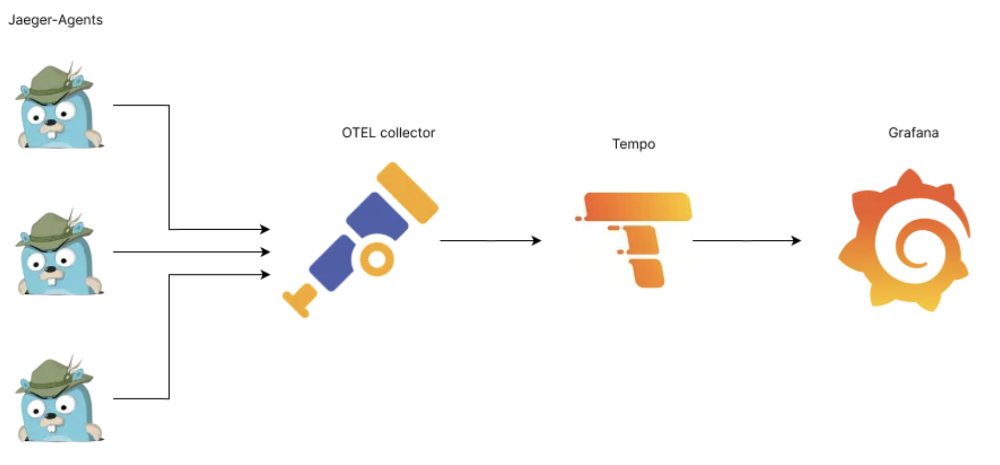

# AI-orchestration system

## The app

This app is a distributed AI orchestration system designed for asynchronous prompt processing, allowing users to run tasks or conduct long-term research. 
The system is designed to be highly available, "bulletproof", and fast enough. 
For this purpose, the design consists of several microservices, which communicate via Redis Streams. 
This approach allows scaling application computing power horizontally, decreasing overall deployment cost. 
Also, the app is designed to be highly observable. 
There is already an integrated Grafana dashboard that shows not only tracing and performance metrics but also business metrics, such as *prompts/cost per user*, *AI model popularity across users*, etc. 
The app is already set up for Gemini's free tier. Enabling it is described below.

## Architecture
Here is a visualization of the architectural design of the application:

> [!NOTE]
> You can see the full design [here](https://excalidraw.com/#json=mgo5-7O6Juynd4xIOb3tq,GLRfdZp3B8TTXyg0suKXPg)

The idea might seem simple: Get the user prompt -> Send it to the AI model -> Return the result to the user.
But the underlying architecture is designed to be stable and to face business needs. First and foremost, using observability.
Here is a simple explanation of how it works under the hood:
1. The prompt is sent to the `POST /ask`
2. Prompt validated and processed. If there are validation issues, the client receives a **400 ** request status. Otherwise - **202 Accepted**.
3. The corresponding **Event** was created and, within a single transaction, saved into PostgreSQL along with **Prompt**.
4. **Relay** background task, within the same microservice, reads from **outbox** table, and publishes the event into Redis Stream with ID "tasks".
5. Then, Redis automatically handles delivery via so-called "Consumer groups" to one out of 5-10 workers (this number is configured inside the Worker microservice).
6. The worker, from a Worker microservice, which is being run in a separate go-routine, reads the task delivered to him and starts processing.
7. The prompt is Unmarshalled and sent to Gemini (for now; later will be configurable).
8. The response is published back to another stream with ID "results".
9. The API microservice reads the result, updates the corresponding prompt inside the Postgres, and shares this entity using WebSocket.
10. The user is now able to read the AI answer using a WebSocket connection.


### A few considerations about integrating Redis Streams and Transactional Outbox:

Redis was chosen because it is fast and easily configurable. There is no need to overengineer an already complicated enough system.
The average task that may be processed via this service may take from 2 to 10-15 seconds to complete. So, competing with RabbitMQ
for an additional millisecond won't be a smart enough idea. And since Redis already has such mechanisms as Pub/Sub and Streams, this is a nice opportunity to use them as a message broker.
Why Streams and not Pub/Sub? The answer is simple: Streams are persistent and reliable (acknowledgment mechanisms), while Pub/Sub stores data in memory
and follows the "fire and forget" principle.

Transactional Outbox was implemented to ensure data consistency. This is important that every request in a distributed system must be processed.
But in the event of failure to write to Postgres or publish to Redis, we must manually handle this message processing. Or the "dual-write" problem appeared,
when a user gets two different responses on a single prompt, even if the prompt was posted one time. This approach guarantees that prompts are saved to the DB and processed via Redis, so all our users will definitely receive the results.

## Deployment

Docker deployment files located in [deployment/docker](deployment/docker) folder. 
To run the compose file you are supposed to create `.api_env` and `.worker_env` files in the root directory of the project, with the
next variables:
**.api_env**
```dotenv
PORT=8080
APP_ID=ai-orchestrator_api
REDIS_URI=redis:6379
JAEGER_URI=otel-collector:4318
CACHE_TTL_MINUTES=5
REDIS_PUB_STREAM_ID=tasks
REDIS_RES_STREAM_ID=results

POSTGRES_USER=postgres
POSTGRES_PASSWORD=password
POSTGRES_HOST=postgres
POSTGRES_PORT=5432
POSTGRES_NAME=orchestrator_db

POSTGRES_URI="postgres://${POSTGRES_USER}:${POSTGRES_PASSWORD}@${POSTGRES_HOST}:${POSTGRES_PORT}/${POSTGRES_NAME}?sslmode=disable"
MIGRATIONS_DIR="/app/db/migrations"
```
**.worker_env**
```dotenv
APP_ID=ai-orchestrator_worker
REDIS_URI=redis:6379
JAEGER_URI=otel-collector:4318
REDIS_SUB_STREAM_ID=tasks
REDIS_PUB_STREAM_ID=results
NUMBER_OF_WORKERS=5

GEMINI_API_KEY=your_api_key
```

> [!NOTE]
> To get API key for using Gemini, go to "https://aistudio.google.com/". Click **View API keys**. 
> Copy the one you have enabled (by default, there is free tier API key enabled). Paste into .worker_env file.

After this run: `docker compose -f deployment/docker/docker-compose.yml up --build -d`

To check whether everything is correct, check the logs of the container inside docker application,
the app should start with the appropriate message. 
Make `GET` request via **Postman** or any other tool you like to the `http://localhost:8080/health` endpoint. 
If response **200** everything is fine.

## Redis integration
Redis used as a message broker between microservices. I have chose it, because of its easy integration to project, compared to RabbitMQ. Also it is already
used for caching, so there is no sense at this stage to integrate another complicated service. Moreover, Redis Streams, which were used in this implementation, 
gives you in this concrete case faster processing than basic RabbitMQ. So consider all these aspects, I decided to not overengineer my project and stand by Redis Stream.

Here is the underlying architecture of my approach:


## Distributed Tracing
The distributed tracing is implemented using Jaeger, OpenTelemetry and Grafana. Here is the workflow:

To view the traces, you need to open `http://localhost:3000`, then in login panel enter next credentials:
```
name: admin
password: secret
```
After this, select in the dashboard dropdown list **Connections**, go to **Data Sources**, 
search for **Tempo** and on the opened page in the **Connection** field enter this address: `http://localhost:3100`.
That's it, now Grafana is ready to show you the traces. Go to **Explore**, in **Query** tabs select **Search** one. 
Then go to Postman (or any tool you use to make a requests) and do some. Return to Grafana and click **Run query**. 
Here it is, if you've done everything correctly, you should see some logs.

> [!NOTE]
> In case of any errors, you may check this link: [How to setup observability of Golang microservices using Jaeger, OTEL-collector, Tempo & Grafana](https://medium.com/@vahagn.mian/how-to-setup-observability-of-golang-microservices-using-jaeger-otel-collector-tempo-grafana-b502e72f2bf3)